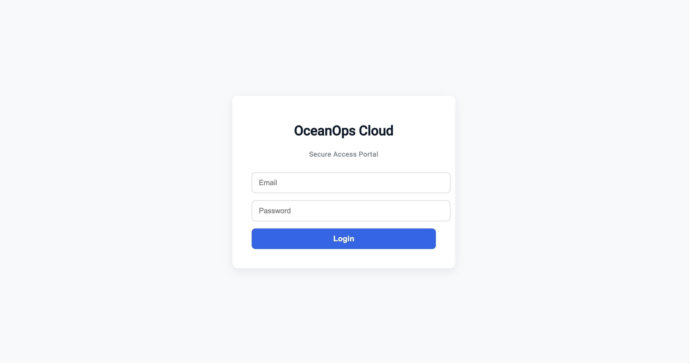
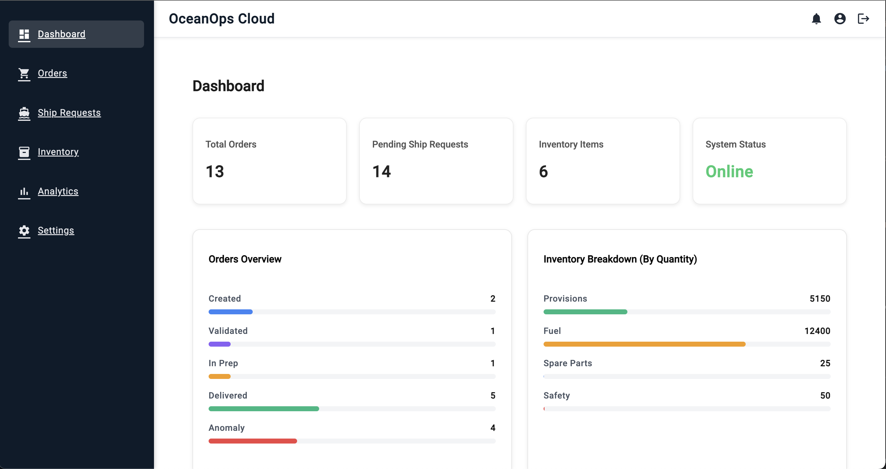
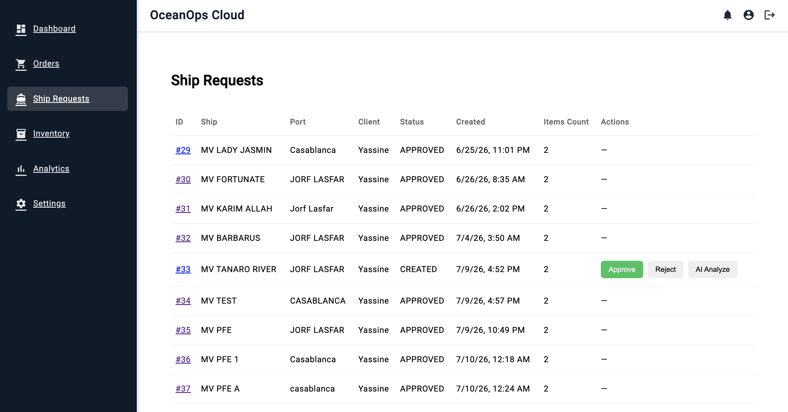
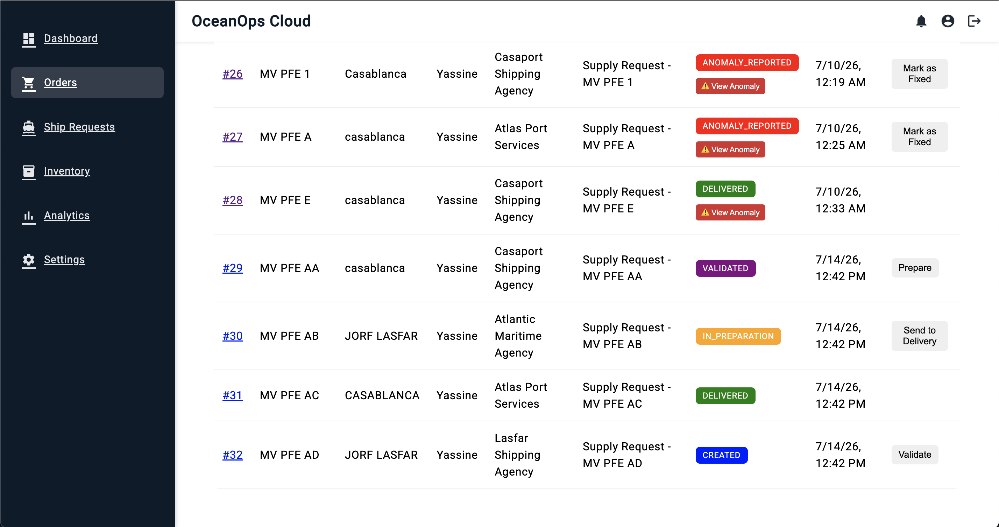
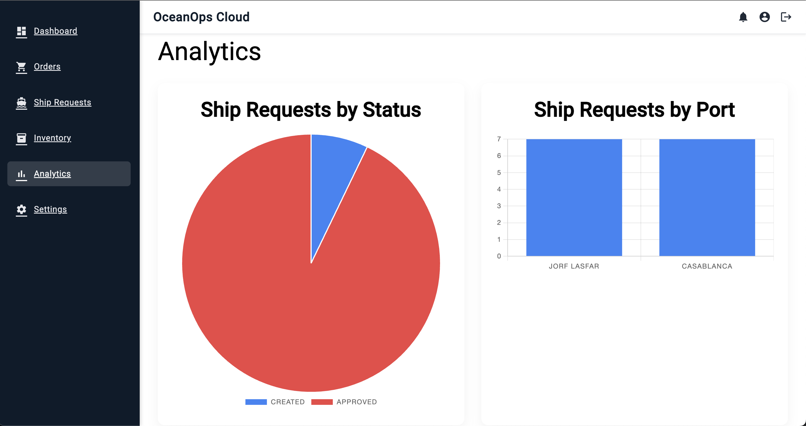
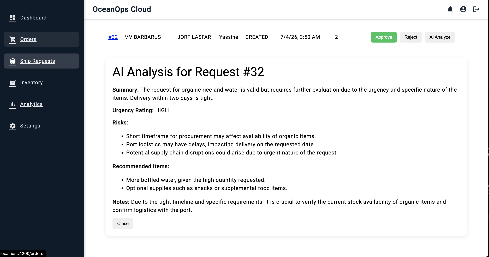
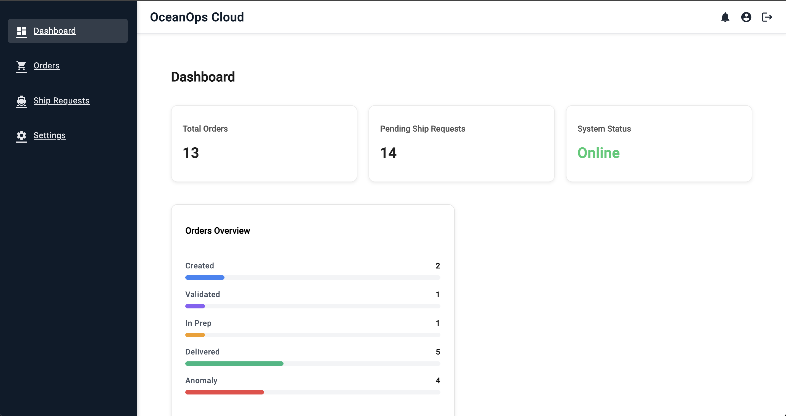
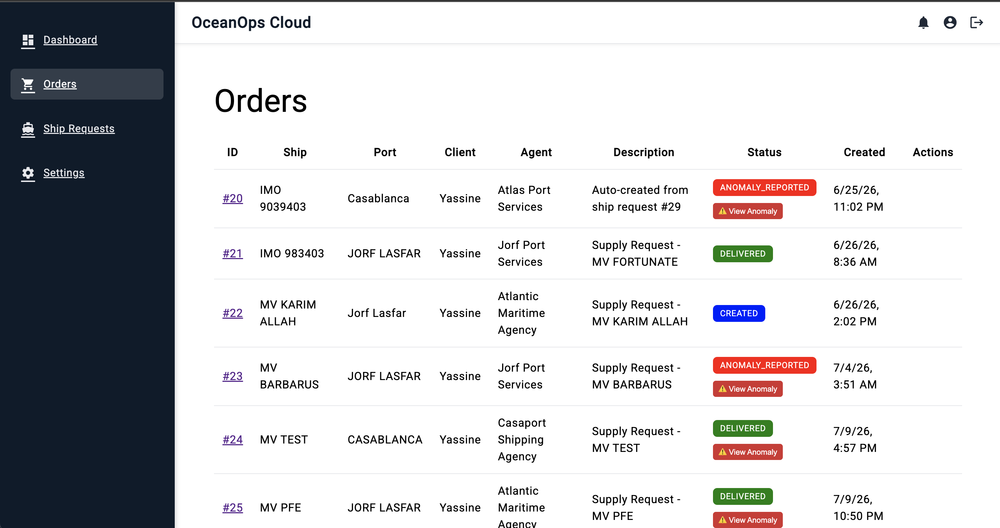

# OceanOps Cloud

> Shipchandling logistics platform with integrated order management, operational workflows, and AI-assisted features.


## Contents

- [Overview](#overview)
- [Features](#features)
- [Technology Stack](#technology-stack)
- [Architecture](#architecture)
- [Application Screenshots](#application-screenshots)
- [Installation](#installation)
- [Configuration](#configuration)
- [Future Improvements](#future-improvements)

## Overview

OceanOps Cloud is a full-stack web platform designed to streamline shipchandling operations by centralizing ship requests, supply orders, and operational workflows.

The platform enables collaboration between clients, shipchandlers, port agents, and administrators through a role-based architecture while providing real-time order tracking, analytics dashboards, and AI-assisted ship request analysis.

The platform supports three primary user roles:

- Client (Ship)
- Shipchandler
- Port Agent

Each role is provided with dedicated interfaces and workflows tailored to its operational responsibilities.

## Features

- Secure authentication with role-based access control
- Ship request creation and approval workflow
- Order lifecycle management and tracking
- Port agent management
- AI-assisted ship request analysis
- Operational analytics dashboard
- Notification management
- Order status history and audit tracking
- RESTful API architecture
- File attachment support for ship requests

## Technology Stack

| Layer | Technologies |
|--------|--------------|
| Backend | Java 17, Spring Boot, Spring Security, Spring Data JPA |
| Frontend | Angular, TypeScript, Angular Material |
| Database | MySQL |
| Build Tools | Maven, npm |
| AI Integration | OpenAI API (optional) |

## Project Structure

```text
.
├── backend/                 # Spring Boot REST API
├── frontend/                # Angular web application
├── docs/
│   └── screenshots/         # Application screenshots
├── README.md
└── .gitignore
```

## Architecture

OceanOps Cloud follows a three-tier architecture composed of:

- **Frontend:** Angular application providing role-based user interfaces.
- **Backend:** Spring Boot REST API handling authentication, business logic, and workflow management.
- **Database:** MySQL storing operational, user, and order data.

The system exposes RESTful APIs consumed by the Angular client while Spring Security enforces authentication and authorization.

The architecture separates presentation, business logic, and data persistence, improving maintainability, scalability, and ease of future integration with external maritime services.

# Application Screenshots

## Authentication

### Login



## Client Portal

### Dashboard



### Ship Requests



## Shipchandler Portal

### Orders



### Analytics



### AI Analysis



## Port Agent Portal

### Dashboard



### Orders



## Installation

### Clone the repository

```bash
git clone https://github.com/Yassinebouchida/oceanops-cloud-app.git
cd oceanops-cloud-app
```

### Backend

```bash
cd backend
mvn spring-boot:run
```

### Frontend

```bash
cd frontend/oceanops-web
npm install
ng serve
```


## Configuration

Configure the following environment variables before running the application:

| Variable | Description |
|----------|-------------|
| DB_URL | MySQL connection URL |
| DB_USERNAME | Database username |
| DB_PASSWORD | Database password |
| OPENAI_API_KEY | Optional OpenAI API key for AI-assisted analysis |

## Future Improvements

- Develop a mobile application to allow clients, shipchandlers, and port agents to manage operations on the go.
- Enhance AI-assisted analysis by providing more accurate recommendations and decision support for ship requests.
- Integrate the platform with other maritime systems (e.g., port management, ERP, and logistics platforms) to improve interoperability.
- Introduce real-time notifications to keep all stakeholders informed of order status changes and operational events.
- Expand analytics dashboards with additional KPIs and reporting tools for operational monitoring.
- Improve inventory forecasting and demand prediction using historical operational data and AI models.
- Support multi-company and multi-port deployments to make the platform scalable for larger maritime operations.


## Acknowledgements

This project was developed as part of a final-year engineering internship at **North West Africa Suppliers (NWAS)**, focusing on the digital transformation of shipchandling operations.